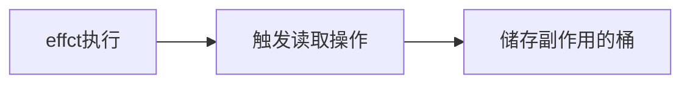

# 响应式数据与副作用函数

副作用函数指的是会产生副作用的函数，如以下代码

```js
function effect(){
  document.body.innerText = 'hello vue3'
}
```

当effect执行时，会设置body的文本内容，除此之外任何函数都可以读取或设置body的文本内容，也就是说**effect函数的执行会直接或间接影响其它函数的执行**，这时我们说effect函数产生了副作用，例如一个函数修改了全局变量，这其实也是一个副作用

响应式数据

```js
const obj = {
  text:'hello world'
}
function effect(){
  document.body.innerText = obj.text
}
```

当副作用执行时，会设置body的值，值为obj.text，当obj.text发生变化时，我们希望effect函数重新执行，如果我们实现这个目标，那么obj就是响应式数据

# 响应式数据的基本实现

怎么才能让obj变成响应式数据呢，我们发现

- 当副作用函数执行时，会触发字段obj.text的读取操作
- 当修改obj.text的值时，会触发obj.text的修改操作

如果我们能够拦截一个对象的读取和设置操作，当读取字段时，将副作用函数储存到一个桶里，如图



当设置字段时，再将副作用函数从桶中取出来执行即可

```mermaid
graph LR;
    obj.text='1'-->触发设置操作;
    触发设置操作-->储存副作用的桶;
    储存副作用的桶-->取出effect并执行
```

现在的问题变成了如何才能拦截一个对象属性的读取与设置操作，通过代理对象proxy实现

```js
const bucket = new Set()	//存储副作用函数的桶
const data = { text:'hello' }	//原始数据
const obj = new Proxy(data,{
  get(target,key){
    bucket.add(effect)	//将副作用添加到桶中
    return target[key]
  },
  set(target,key,value){
    target[key] = value
   	bucket.forEach(fn=>fn()) 	//取出副作用并执行
    return true
  }
})
```

代码测试

```js
function effect(){
  document.body.innerText = obj.text
}
setTimeout(()=>{
  obj.text = 'vue3'
},1000)
```

目前还存在很多缺陷，例如我们可以直接通过名字（effect）来获取副作用函数，不灵活，副作用函数的名字可以任意取，甚至是一个匿名函数，必须想办法去掉这些限制。

# 完善的响应式系统

如果副作用函数为一个匿名函数，如何正确的收集到桶中，因此我们需要提供一个用来注册副作用函数的机制

```js
let activeEffect
function effect(fn){
  activeEffect = fn
  fn()
}
```

使用effect函数

```js
effect(()=>{
  document.body.innerText = obj.text
})
```

执行被注册的匿名函数，这会触发响应式数据`obj.text`的读取操作，进而触发代理对象Proxy的get拦截函数

```js
const obj = new Proxy(data,{
  get(target,key){
    if(activeEffect){
      bucket.add(activeEffect)
    }
    return target[key]
  },
  set(target,key,value){
    target[key] = value
    bucket.forEach(fn=>fn())
    return true
  }
})
```

如果我们在响应式数据中添加一个不存在的属性时

```js
effect(()=>{
  document.body.innerText = obj.text
})
setTimeout(()=>{
  obj.notExist = 'vue3'
},1000)
```

匿名副作用函数内并没有读取` obj.notExist`属性的值，所以理论上字段`obj.notExist`并没有与副作用建立联系，因此定时器内语句执行不应该触发副作用函数的重新执行，但是却重新执行了。原因在于**我们没有在副作用函数与被操作的目标字段之间建立明确的联系**。

我们分析这一段代码

```js
effect(function effectFn(){
  document.body.innerText = obj.text
})
```

这段代码中有三个角色

- 副作用函数`effectFn`
- 被读取的代理对象`target:obj`
- 被读取的字段名`key:text`

那么可建立以下关系

```
target
--key
----effectFn
```

如果两个副作用函数同时读取同一个对象的属性值

```js
effect(function effectFn1(){
  obj.text
})
effect(function effectFn2(){
  obj.text
})
```

那么关系如下

```
target
--text
----effectFn1
----effectFn2
```

如果一个副作用函数中读取了同一个对象的不同属性

```js
effect(function effectFn(){
  obj.text1
  obj.text2
})
```

那么关系如下

```
target
--text1
----effectFn
--text2
----effectFn
```

如果不同的副作用函数中读取了两个不同对象的不同属性

```js
effect(function effectFn1(){
  obj1.text
})
effect(function effectFn2(){
  obj2.text
})
```

那么关系如下

```
target1
--text
----effectFn1
target2
--text
----effectFn2
```

接下来我们使用代码实现这个桶，使用`weakMap`代替set作为桶的数据结构，使用`WeakMap`当key没被引用时才会被自动回收

```js
const bucket = new WeekMap()
//追踪属性，收集到桶中
function track(target,key){			
  if(!activeEffect) return 
    let depsMap = bucket.get(target)
    if(!depsMap){
      bucket.set(target,depsMap = new Map())
    }
    let deps = depsMap.get(key)
    if(!deps){
      depsMap.set(key,deps = new Set())
    }
    deps.add(activeEffect)
}
//取出副作用重新执行
function trigger(target,key){
  const depsMap = bucket.get(target)
  if(!depsMap) return 
  const effects = depsMap.get(key)
  effects && effects.forEach(fn=>fn())
}
const obj = new Proxy(data,{
  get(target,key){
    track(target,key)
    return target[key]
  },
  set(target,key,value){
    target[key] = value
    trigger(target,key)
  }
})
```

数据结构如下


# 分支切换与cleanup

定义如下

```js
const data = {
  ok:true,
  text:'hello'
}
const obj = new Proxy(data,{/* ... */})
effect(()=>{
  document.body.innerText = obj.ok ? obj.text : 'not'
})
```

函数内部存在一个三元表达式，根据字段 `obj.ok` 的值的不同会执行不同的代码，当字段 `obj.ok` 的值变换时，代码执行的分支会跟着变化，这就是分支切换。

分支切换可能会产生遗留的副作用函数，当字段 `obj.ok` 的值 true 时，这时会读取 `obj.text` 的值，会建立如下的关系

```js
data
--ok
----effectFn
--text
----effectFn
```

当把字段 `obj.ok` 的值修改为 false，并触发副作用函数重新执行后，由于 `obj.text` 的值不会被读取，所以`effectFn`不应该被 `obj.text` 字段收集，此时应该为如下关系

```js
data
--ok
----effectFn
```

但是目前的代码中`obj.text`字段任然收集着`effectFn`的，这时就产生了遗留的副作用函数，遗留的副作用函数会导致不必要的更新，就上面的代码来说，当`obj.ok`的值为 true 时，理论上不论如何修改`obj.text`的值都不会触发副作用函数的重新执行，但事实上我们修改`obj.text`的值也会触发副作用函数的重新执行。

为了解决这个问题，我们只需要在每次副作用函数执行时先把它从所有相关联的依赖集合中删除，因此需要知道哪些依赖集合包含这个函数


当副作用函数函数执行完毕后，会重新建立联系，但在新的联系中不会包含遗留的副作用函数。

如下面代码

```js
let activeEffect
function effect(fn){
  const effectFn = ()=>{
    activeEffect = effectFn
    fn()
  }
  effectFn.deps = []	//收集与之关联的依赖集合
  effectFn()
}
```

`effectFn.deps`如何收集依赖集合

```js
function track(target,key){			
  if(!activeEffect) return 
  let depsMap = bucket.get(target)
  if(!depsMap){
    bucket.set(target,depsMap = new Map())
  }
  let deps = depsMap.get(key)
  if(!deps){
    depsMap.set(key,deps = new Set())
  }
  deps.add(activeEffect)
  activeEffect.deps.push(deps)	//收集依赖集合
}
```

建立起了如下关系


副作用函数执行时，将副作用函数从所有依赖集合中删除

```js
let activeEffect 
function effect(fn){
  const effectFn = ()=>{
    cleanUp(effectFn)
    activeEffect = effectFn
    fn()
  }
  effectFn.deps = []
  effectFn()
}
function cleanUp(effectFn){
  for(let i=0;i<effectFn.deps.length;i++){
    const deps = effectFn.deps[i]
    deps.delete(effectFn)
  }
  effectFn.deps.length = 0
}
```

但现在还存在一个问题，当我们修改响应式数据字段时，会发现目前的实现会导致无限循环，问题出现在这

```js
function trigger(target,key){
  const depsMap = bucket.get(target)
  if(!depsMap) return 
  const effects = depsMap.get(key)
  effects && effects.forEach(fn=>fn())		//这里是问题
}
```

修改字段时，会触发trigger函数执行副作用函数，首先会执行删除，将副作用函数从所有依赖集合中删除，接着执行匿名函数，触发读取操作，又会将副作用函数重新收集到依赖集合中，此时我们还在问题代码的遍历当中，简化来看就是如下

```js
const set = new Set([1])
set.forEach(item=>{
  set.delete(1)
  set.add(1)
  console.log('遍历中...')
})
```

解决办法很简单，构建一份新的set集合

```js
const set = new Set([1])
const newSet = new Set(set)
newSet.forEach(item=>{
  set.delete(1)
  set.add(1)
  console.log('遍历中...')
})
```

因此我们也按照这样的方式修改trigger函数

```js
function trigger(target,key){
  const depsMap = bucket.get(target)
  if(!depsMap) return 
  const effects = depsMap.get(key)
  const newEffects = new Set(effects)	//构建一份新的set集合，避免无限循环
  newEffects.forEach(fn=>fn())
}
```

# 嵌套的effect与effect栈

effect是可以发生嵌套的，如

```js
effect(function effectFn1(){
  effect(function effectFn2(){/*...*/})
  /*...*/
})
```

在这段代码中，`effectFn1`的执行会导致`effectFn2`的执行，`vue`的渲染函数就是在一个effect中执行的，会应用到这个场景

```js
const Foo =	{
  render(){}
}
effect(()=>{
  Foo.render()
})
```

当组件发生嵌套时，例如`Foo`组件渲染了`Bar`组件,就会发生`effect嵌套`

```js
const Bar = {
  render(){}
}
const Foo = {
  render(){
    return <Bar/>
  }
};
//相当于
effect(()=>{
  Foo.render()
  effect(()=>{
    Bar.render()
  })
})
```

但是目前我们的代码并不支持嵌套，如以下代码

```js
const data = { foo: true, bar: true }
const obj = new Proxy(data,{/*...*/})
let temp1,temp2
effect(function effectFn1(){
  console.log('effectFn1')
  effect(function effectFn2(){
    console.log('effectFn2')
    temp2 = obj.bar
  })
  temp1 = obj.foo
})
```

在这段代码中`effectFn1`的执行会导致`effectFn2`的执行，理想情况下，我们希望建立以下的联系

```js
data
--foo
----effectFn1
--bar
----effectFn2
```

在这种情况下，我们希望当修改`obj.foo`时会触发`effectFn1`执行，同时也会间接导致`effectFn2`执行，当修改`obj.bar`时，只会触发`effectFn2`执行，但是实际情况却不是这样，比如说我们修改`obj.foo`的值，会发现输出

```js
'effectFn1'		//初始化调用effect输出结果
'effectFn2'		//初始化调用effect输出结果
'effectFn2'		//修改obj.foo时的输出结果
```

问题出现在第三行代码，我们发现`effectFn1`并没有直接执行，反而执行的是`effectFn2`问题出现在以下代码中

```js
function effect(fn){
  const effectFn = ()=>{
    cleanUp(effectFn)
    activeEffect = effectFn		//问题出现在这
    fn()
  }
  effectFn.deps = []
  effectFn()
}
```

我们使用全局变量`activeEffect`来存储`effect`函数注册的副作用函数，意味着同一时间所存储的函数只能有一个，当副作用函数函数发生嵌套时，内层副作用函数会覆盖`activeEffect`的值，就上面的代码来说，先收集的是`obj.bar`，此时`activeEffect`指向`effectFn2`,当内层副作用函数执行完成时，收集`obj.foo`，此时`activeEffect`指向`effectFn2`，建立的关系如下

```js
data
--foo
----effectFn2
--bar
----effectFn2
```

为了建立正确的关系，我们来捋一下流程，执行`effectFn1`前，`activeEffect`指向`effectFn1`,进入内层副作用函数，`activeEffect`指向`effectFn2`,当内层副作用函数执行完成后，我们希望`activeEffect`指向`effectFn1`,这样`obj.foo`才能收集正确的副作用函数。因此使用栈来实现这个需求

```js
let activeEffect 
let effectStack = []
function effect(fn){
  const effectFn = ()=>{
    cleanUp(effectFn)
    activeEffect = effectFn
    effectStack.push(activeEffect)
    fn()
    effectStack.pop()
    activeEffect = effectStack[effectStack.length - 1]
  }
  effectFn.deps = []
  effectFn()
}
```

# 避免无限递归循环

我们考虑这样一个情况

```js
const data = {foo:1}
const obj = new Proxy(data,{/*...*/})
effect(()=>obj.foo = obj.foo + 1)
```

该操作会导致无线循环，在这段代码中，首先读取`obj.foo`的值，收集副作用函数，接着设置`obj.foo`的值，执行副作用函数，接着又有读取与设置的操作，问题是该副作用函数正在执行中，又要开始下一次的执行，导致无线循环。通过分析这个问题，我们发现读取和设置操作是在同一个副作用函数中发生的，因此`track`时收集和`trigger`时触发执行的副作用函数都是`activeEffect`，因此在`trigger`中正在执行的副作用函数与`activeEffect`相同时不执行

```js
function trigger(target,key){
  const depsMap = bucket.get(target)
  if(!depsMap) return 
  const effects = depsMap.get(key)
  const newEffects = new Set()
  effects && effects.forEach(fn=>{
    if(fn !== activeEffect){
      newEffects.add(fn)
    }
  })
  newEffects.forEach(fn=>fn())
}
```

# 调度执行

指的是当trigger动作触发副作用函数从新执行时，有能力决定副作用函数执行的时机，次数，以及方式

## 执行时机

如有下面一个需求

```js
const data = {foo:1}
const obj = new Proxy(data,{/**/})
effect(()=>{
  console.log(obj.foo)
})
obj.foo++
console.log('结束了')
```

输出结果为

```text
1
2
结束了
```

如过需要调整以下输出顺序

```text
1
结束了
2
```

我们如何在不调整代码的情况下实现这个需求，我们可以为effect函数设计一个选项参数，允许用户指定调度器

```js
effect(()=>{
  console.log(obj.foo)
},{
  //调度器
  scheduler(fn){}
})
```

用户在调用effect注册副作用函数时，可以传递第二参数

```js
function effect(fn,options = {}){
  const effectFn = ()=>{
    cleanUp(effectFn)
    activeEffect = effectFn
    effectStack.push(effectFn)
    fn()
    effectStack.pop()
    activeEffect = effectStack[effectStack.length - 1]
  }
  effectFn.options = options	//保存第二参数
  effectFn.deps = []
  effectFn()
}
```

在trigger函数中触发副作用函数重新执行时，就可以调用用户传递的调度器函数，将控制权交给用户

```js
function trigger(target,key){
  const depsMap = bucket.get(target)
  if(!depsMap) return 
  const effects = depsMap.get(key)
  const newEffects = new Set()
  effects && effects.forEach(fn=>{
    if(fn !== activeEffect){
      newEffects.add(fn)
    }
  })
  newEffects.forEach(fn=>{
    //调度执行
    if(fn.options.scheduler){
      fn.options.scheduler(fn)
    }else{
      fn()
    }
  })
}
```

现在我们可以来实现需求了

```js
const data = {foo:1}
const obj = new Proxy(data,{/**/})
effect(()=>{
  console.log(obj.foo)
},{
  scheduler(fn){
    setTimeout(fn)
  }
})
obj.foo++
console.log('结束了')
```

## 执行次数

有如下例子

```js
const data = {foo:1}
const obj = new Proxy(data,{/**/})
effect(()=>{
  console.log(obj.foo)
})
obj.foo++
obj.foo++
```

输出如下

```text
1
2
3
```

如果我们只关心结果不关心过程，那么执行三次的操作是多余的，我们希望的打印结果是

```text
1
3
```

基于调度器，我们可以很容易的实现此功能

```js
const jobQueue = new Set()
const p = Promise.resolve()
let isFlushing = false
function flushJob (){
  if(isFlushing) return 
  isFlushing = true
  p.then(()=>{
    jobQueue.forEach(job=>job())
  }).finally(()=>{
    isFlushing = false
  })
}
effect(()=>{
  console.log(obj.foo)
},{
  scheduler(fn){
    jobQueue.add(fn)
    flushJob()
  }
})
obj.foo++
obj.foo++
```

在上面的代码中，我们不管修改多少次响应式数据，队列里只会存在一个副作用函数，且只有在最后才执行一次

# 计算属性与lazy

在有些场景下我们并不希望副作用函数立即执行，而是希望它在需要的时候才执行，例如计算属性，这时我们可以通过在options中添加lazy属性来达到目的

```js
effect(()=>{},{
  lazy:true
})
```

当lazy为true时，则不立即执行副作用函数

```js
function effect(fn,options = {}){
  const effectFn = ()=>{
    cleanUp(effectFn)
    activeEffect = effectFn
    effectStack.push(effectFn)
    fn()
    effectStack.pop()
    activeEffect = effectStack[effectStack.length - 1]
  }
  effectFn.options = options
  effectFn.deps = []
  if(!options.lazy){
    effectFn()
  }
  return effectFn
}
```

现在问题是副作用函数什么时候执行呢，通过返回副作用函数就能手动执行副作用函数了，如果是手动执行则意义不大，但如果我们把传递给effect的函数看作一个getter，那么这个getter可以返回任何值

```js
const effectFn = effect(()=>obj.foo + obj.bar,{lazy:true})
```

这样我们在手动执行副作用函数时，就能够拿到其返回值

```js
const value = effectFn() //value是obj.foo + obj.bar的和
```

我们需要修改effect函数

```js
function effect(fn,options = {}){
  const effectFn = ()=>{
    cleanUp(effectFn)
    activeEffect = effectFn
    effectStack.push(effectFn)
    const res = fn()
    effectStack.pop()
    activeEffect = effectStack[effectStack.length - 1]
    return res 	//新增返回值
  }
  effectFn.options = options
  effectFn.deps = []
  if(!options.lazy){
    effectFn()
  }
  return effectFn
}
```

接下来实现计算属性

```js
function computed(getter){
  const effectFn = effect(getter,{lazy:true})
  const obj = {
    get value(){
      return effectFn()
    }
  }
  return obj
}
```

只有当读取value的值时，才会执行`effectFn`并将结果作为返回值返回。我们可以使用computed函数来创建一个计算属性

```js
const data = {foo:1,bar:2}
const obj = new Proxy(data,{/**/})
const sumRefs = computed(()=>obj.foo+obj.bar)
console.log(sumRefs.value)
```

但假如我们多次访问`sumRefs.value`的值，会导致`effectFn`多次计算，即使值没有变化，需要对值进行缓存

```js
function computed(getter){
  let value		//保存上一次的值
  let dirty = true  //标志是否需要重新计算值
  const effectFn = effect(getter,{
    lazy:true,
    //添加调度器，当obj.foo或obj.bar的值发生变化时，将dirty重置为true
    scheduler(){
      dirty = true
    }
  })
  
  const obj = {
    get value(){
      if(dirty){
        value = effectFn()
        dirty = false
      }
      return value
    }
  }
  return obj
}
```

现在我们考虑这样一个场景，当我们在另一个effect中读取计算属性的值时

```js
const sumRefs = computed(()=>obj.foo+obj.bar)
effect(()=>{
  console.log(sumRefs.value)
})
obj.foo++
```

当我们修改`obj.foo`的值时，我们希望副作用函数能够冲重新执行，实际上并没有。分析原因，我们发现本质就是副作用嵌套，但是外层的副作用并没有被收集到，当我们修改`obj.foo`的值时，只会执行内层的副作用函数，解决办法很简单，只需要收集外层的副作用函数即可。这样在

```js
function computed(getter){
  let value
  let dirty = true  
  const effectFn = effect(getter,{
    lazy:true,
    scheduler(){
      dirty = true
      //当数据变化时，手动调用
      trigger(obj,'value')
    }
  })
  
  const obj = {
    get value(){
      if(dirty){
        value = effectFn()
        dirty = false
      }
      track(obj,'value')	//读取时追踪
      return value
    }
  }
  return obj
}
```

这样就建立起了以下联系

```js
computed(obj)
--value
----effectFn
```

# watch的实现原理

`watch`本质是观测一个响应式数据，当数据发生变化时通知，并执行相应的回调函数、

```js
watch(obj,()=>{
  console.log('数据改变了')
})
obj.foo++
```

`watch`的实现利用的`effect`以及`options.scheduler`选项，简单实现

```js
function watch(source,cb){
  effect(
    ()=>source.foo,  //触发读取操作，从而建立联系
    {
    scheduler(fn){
      cb()
    }
  })
}
```

上面的代码中只能观测`obj.foo`的改变，为了让watch函数更具有通用性，需要封装一个通用的读取操作

```js
function watch(souce,cb){
  //调用traverse递归的读取,建立起联系
  effect(()=>traverse(source),{
    scheduler(){
      cb()
    }
  })
}
function traverse(value,seen = new Set()){
  //避免死循环，如这样的值 obj = {a:1,b:obj}
  if(typeof value !=='object' || value == null || seen.has(value)) return 
  seen.add(value)
  for(const k in value){
    traverse(value[k],seen)
  }
  return value
}
```

watch的第一参数处理对象外，还可以是函数

```js
function watch(source,cb){
  let getter
  if(typeof source == 'function'){
    getter = source
  }else{
    getter = ()=>traverse(source)
  }
  effect(getter,{
    scheduler(){
      cb()
    }
  })
}
```

除此之外，我们在回调函数中能够得到变化前后的值，这时我们可以利用`effect`函数的`lazy`选项

```js
function watch(source,cb){
  let getter
  if(typeof source == 'function'){
    getter = source
  }else{
    getter = ()=>traverse(source)
  }
  let oldValue,newValue
  const effectFn = effect(getter,{
    lazy:true
    scheduler(){
      newValue = effectFn()
      cb(newValue,oldValue)
      oldValue = newValue
    }
  })
  oldValue = effectFn()  //拿到旧值
}
```

# 立即执行的watch与回调执行时机

默认情况下，watch的回调只会在响应式数据发生变化时才执行，我们可以通过一些参数指定回调执行的时机

立即执行的回调

```js
function watch(source,cb,options = {}){
  let gettter 
  if(typeof source == 'function'){
    getter = source
  }else{
    getter = ()=>traverse(source)
  }
  let oldValue,newValue
  const job = ()=>{
    newValue = effectFn()
    cb()
    oldValue = newValue
  }
  const effectFn = effect(getter,{
    lazy:true,
    scheduler(){
      job()
    }
  })
  if(options.immediate){
    job()
  }else{
    oldValue = effectFn()
  }
}
```

# 过期的副作用

竞态问题，比如说

```js
let finalData
watch(obj,async ()=>{
  const res = await fetch('/path/to/request')
  finalData = res
})
```

会有这样一个场景，当我们第一次修改`obj`的值，会发送一次请求`A`，在请求`A`的结果返回之前再次修改`obj`的值，发送一次请求`B`，我们不能确定哪次请求的结果先返回，如果`B`的结果先于`A`返回，就会导致`finalData`中存储的时`A`的结果，但由于请求`B`是后发送的，因此我们认为`B`的结果才是最新的，`finalData`中存储的是`B`的值，因此第一次的请求就是过期的。

在`vue.js`中，通过回调函数的第三个参数`onInvalidate`，它是一个函数，通过`onInvalidate`注册一个函数，这个函数会在当前副作用函数过期时执行

```js
watach(obj,async (newValue,oldValue,onInvalidate)=>{
  let expired = false
  onInvalidate(()=>{
    expired = true
  })
  const res = await fetch(url)
  if(!expired){
    finalData = res
  }
})
```

实现也很简单，在副作用函数重新执行前，会先调用通过`onInvalidate`函数注册的过期回调

```js
function watch(source,cb,options = {}){
  let gettter 
  if(typeof source == 'function'){
    getter = source
  }else{
    getter = ()=>traverse(source)
  }
  
  let cleanUp  //保存用户注册的回调函数
  const onInvalidate = (fn)=>{
    cleanUp = fn
  }
  
  let oldValue,newValue
  const job = ()=>{
    newValue = effectFn()
    if(cleanUp){
      cleanUp() //每次回调执行前，调用用户前一次注册的回调
    }
    cb(newValue,oldValue,onInvalidate)
    oldValue = newValue
  }
  const effectFn = effect(getter,{
    lazy:true,
    scheduler:job
  })
  if(options.immediate){
    job()
  }else{
    oldValue = effectFn()
  }
}
```

就上面的例子来解释一下，当用户先请求`A`，后请求`B`，`B`的结果先返回，`A`的回调函数执行先于`B`，在执行`B`的回调时会先调用`A`注册的过期回调将`expired`设置为`true`，不会保存`A`的结果。